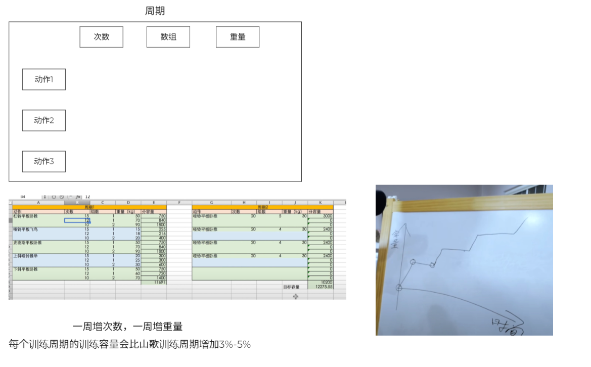

# Weight Training Calculator

This is a simple weight training calculator that calculates the weight you should lift based on increasing the weight by 3 - 5% each period.

## Exercises

Back

Chest

## References

- https://www.youtube.com/watch?v=zmvFXjo-k14
